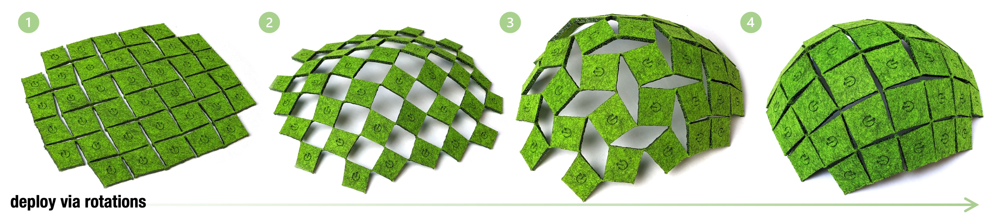
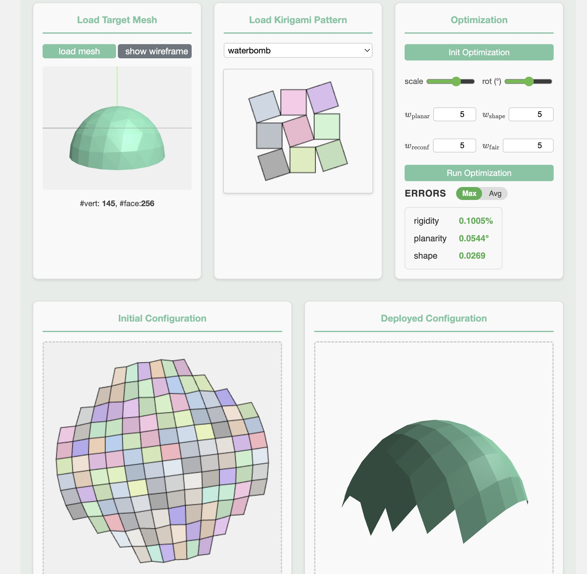

# Reconfigurable Hinged Kirigami Tessellations
<p>

</p>

This is an example code for our paper "Reconfigurable Hinged Kirigami Tessellations", *SIGGRAPH Asia 2025 (conference track)*, by [Aviv Segall*](https://igl.ethz.ch/people/), [Jing Ren*](https://ren-jing.com/), [Marcel Padilla](https://marcelpadilla.com/) and [Olga Sorkine-Hornung](https://igl.ethz.ch/people/sorkine).


In this project, we introduce a computational method for **designing kirigami patterns that reconfigure flat sheets into complex shapes**. By analyzing planar tilings and their rotational deployment, we identify valid cuts and generate novel, physically realizable structures. This enables inverse design of expressive, gap-free geometries through combinatorial reconfiguration.

More details about our paper can be found at: [[web demo]]() | [[project page]](https://igl.ethz.ch/projects/kirigami/) | [[paper]]() | [[suppl. video]](https://www.youtube.com/watch?v=DyvxWxhdnbg)) 

## Implementation
We implemented a [web demo]() with interactive user interfaces (see screenshots below). 
| Figure 1: UI for pattern design | Figure 2: UI for shape approximation|
|:--------------------------:|:--------------------------:|
|  | |

Specifically, we have:
- **UI for designing hinged kirigami patterns** (Fig.1):
  - In the ```Design Canvas``, users can click three points to create a group of parallel lines (the first two pionts determine the base line, the third point determines the offset)
  - Users can add multiple groups of parallel lines by keeping clicking on the canvas
  - After clicking the ```cut tiling into kirigami``` button, the extracted kirigami pattern will be displayed in the ```Preview Canvas```. The deployment-unfriendly vertices (see Def.4.1 in our paper) will be highlighted in red. If there is no such vertices, the deployment will be displayed automatically
- **UI for realizing 3D shapes from hinged kirigami patterns** (Fig.2):
  -  Users can load a *disk-topology* triangle mesh and a pre-defined uniformly deployable kirigami pattern
  -  Users can specify the number (```scale``` parameter) and the orientation (```rot``` parameter) of the tiles, the initialization (2D and 3D) will be displayed simutaneously.
  -  Clicking the ```run optimization''' button will start to optimize the vertices in both 2D and 3D to achieve the reconfigurable kirigami pattern.


Please refer to our paper for more techinical details. Full implementation can be found in the folder ```web_demo```. 
The cutting patterns of some optimized hinged kirigami patterns for realizing 3D shapes can be found in the folder  ```fabrication_patterns```. You can use laser cutter to print these patterns on paper or felt to reproduce the fabrications shown in the paper.

## Acknowledgements
The authors thank the anonymous reviewers for their valuable
feedback. 
The authors are especially grateful to ***Helmut Pottmann***
for the discussions and his course offered at ETH Zurich during
his stay with IGL. 
The authors thank ***Florian Rist*** and ***Danielle Luterbacher*** for their advice and assistance with fabrications. 
Special thanks to ***Ruben Wiersma*** for proofreading and for the professional
rendering of Fig. 3. 
The authors further thank ***Mikhail Skopenkov*** and ***Alexander Bobenko*** for insightful comments on Definition 4.1.
The authors thank ***all IGL members*** for their spiritual-academic
support. This work was supported in part by the ERC Consolidator
Grant No. 101003104 (MYCLOTH) and the Feodor Lynen Fellowship.

## Contact
Please let us know (aviv.segall, jing.ren, @inf.ethz.ch) if you have any question regarding the algorithms/paper or you find any bugs in the code (´；д；`)
This work is licensed under a [Creative Commons Attribution-NonCommercial 4.0 International License](http://creativecommons.org/licenses/by-nc/4.0/). For any commercial uses or derivatives, please contact us (aviv.segall, jing.ren, marcel.padilla, sorkine, @inf.ethz.ch). [](https://creativecommons.org/licenses/by-nc/4.0/)
