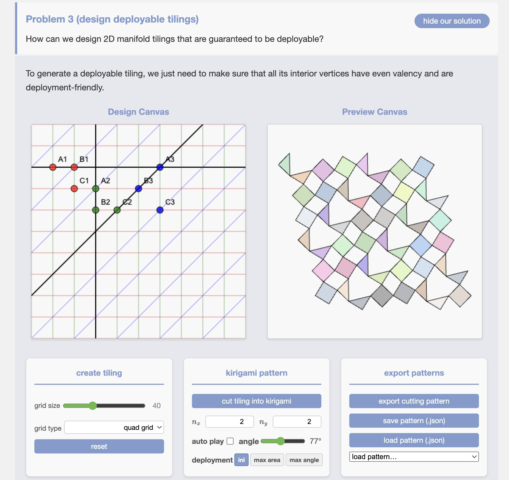

# Reconfigurable Hinged Kirigami Tessellations
<p>

</p>

This repository contains the implementation for our paper "Reconfigurable Hinged Kirigami Tessellations", *SIGGRAPH Asia 2025 (conference track)*, by [Aviv Segall*](https://segaviv.github.io/), [Jing Ren*](https://ren-jing.com/), [Marcel Padilla](https://marcelpadilla.com/) and [Olga Sorkine-Hornung](https://igl.ethz.ch/people/sorkine).


In this project, we introduce a computational method for **designing kirigami patterns that reconfigure flat sheets into complex shapes**. By analyzing planar tilings and their rotational deployment, we identify valid cuts and generate novel, physically realizable structures. This enables inverse design of expressive, gap-free geometries through combinatorial reconfiguration.

More details about our paper can be found at: [[web demo]]() | [[project page]](https://igl.ethz.ch/projects/kirigami/) | [[paper]]() | [[suppl. video]](https://www.youtube.com/watch?v=DyvxWxhdnbg)) 

## Implementation
We provide an interactive [web demo]() with the following interfaces:
| Figure 1: UI for pattern design | Figure 2: UI for shape approximation|
|:--------------------------:|:--------------------------:|
|  | |

Key features:
- **Pattern Design Interface** (Fig.1):
  - In the ```Design Canvas``, users can **click three points** to create a group of parallel lines (first two pionts define the base line, third determines offset)
  - Users can add multiple groups of parallel lines by **continuing to click on the canvas**
  - Click ```Cut Tiling into Kirigami``` to **generate patterns in the Preview Canvas**. Deployment-unfriendly vertices (Definition 4.1 in paper) are highlighted in red; valid patterns deploy automatically.
- **Shape Approximation Interface** (Fig.2):
  -  Users can import *disk-topology* triangle meshes and pre-defined uniformly deployable kirigami patterns
  -  Users can adjust tile density (```scale``` parameter) and tile orientation (```rot``` parameter).  Then the corresponding initialization (2D and 3D) will be displayed simutaneously.
  -  Click ```run optimization''' button to optimize the vertices in both 2D and 3D to achieve the reconfigurable kirigami pattern.


Please refer to our paper for more techinical details. Full implementation can be found in the folder ```web_demo```. 
Pre-optimized cutting patterns for various 3D shapes are provided in the ```fabrication_patterns``` folder. 
These patterns can be laser-cut from paper or felt to reproduce the fabrications demonstrated in the paper.

## Acknowledgements
The authors thank the anonymous reviewers for their valuable
feedback. 
The authors are especially grateful to ***Helmut Pottmann***
for the discussions and his course offered at ETH Zurich during
his stay with IGL. 
The authors thank ***Florian Rist*** and ***Danielle Luterbacher*** for their advice and assistance with fabrications. 
Special thanks to ***Ruben Wiersma*** for proofreading and for the professional
rendering of Fig. 3. 
The authors further thank ***Mikhail Skopenkov*** and ***Alexander Bobenko*** for insightful comments on Definition 4.1.
The authors thank ***all IGL members*** for their spiritual-academic
support. This work was supported in part by the ERC Consolidator
Grant No. 101003104 (MYCLOTH) and the Feodor Lynen Fellowship.

## Contact
Please let us know (aviv.segall, jing.ren, @inf.ethz.ch) if you have any question regarding the algorithms/paper or you find any bugs in the code (´；д；`)
This work is licensed under a [Creative Commons Attribution-NonCommercial 4.0 International License](http://creativecommons.org/licenses/by-nc/4.0/). For any commercial uses or derivatives, please contact us (aviv.segall, jing.ren, marcel.padilla, sorkine, @inf.ethz.ch). [](https://creativecommons.org/licenses/by-nc/4.0/)
